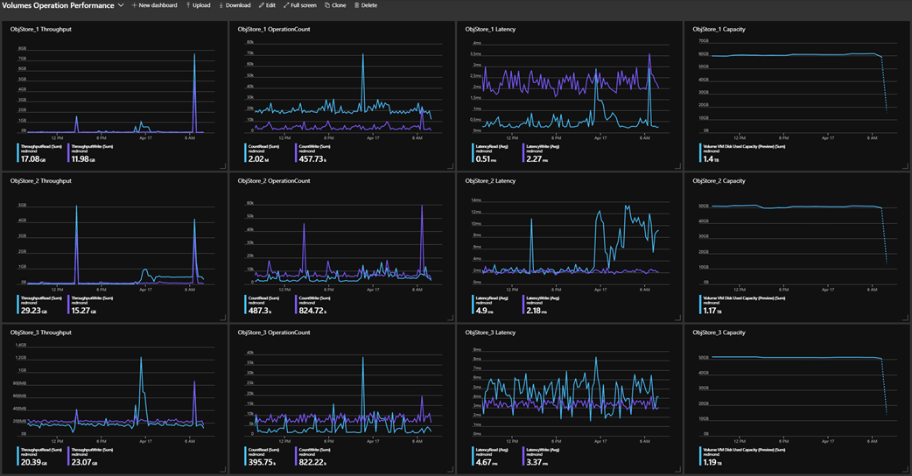

# AzureStack-VolumesPerformanceDashboard-Generator
This tool is used to generate dashboard jsons showing volumes performance used on Azure Stack portal.

### Example
- default json save to spedified location  
`Save-AzureStackVolumesPerformanceDashboardJson -timeGrain "PT15M" -outputLocation '.' `
- data of last week with 1 hour interval  
`Save-AzureStackVolumesPerformanceDashboardJson -duration "P1D" -timeGrain "PT15M"`
- date from 4/1 to 4/8 with 1hr interval  
`Save-AzureStackVolumesPerformanceDashboardJson -startTime (Get-date("2019-04-01")) -endTime (Get-date("2019-04-08")) -timeGrain "PT1H"`

### Feature
- User can specify time range by duration or startTime & endTime.
- User can specify eight types of time granularity. Default type is ‘Automatic’, which adapted to time range.
- Generate multiple json files representing different volume types.

### Usage
The script should run in Azure Stack environment:  
1. Extract files in attached zip.  
2. Log in AzureRm account.  
3. Import psm1 file. You can specify envName, adminSubscriptionName and jsonTemplateLocation in ArgumentList if needed.  
4. Execute function Save-AzureStackVolumesPerformanceDashboardJson with specified needed  parameters.  
	Or you can replace account username, password and ARMendpoint in testDashboardGenerator.ps1, then just one command to replace 2,3,4.  
	./ testDashboardGenerator.ps1  
5. Upload json generated on dashboard.  

### Add new metrics
Change psm1 file. Adapt function Initialize-TilePsCustomObject and Get-TilePsCustomObject, then register in initialized variable metricTypes. 